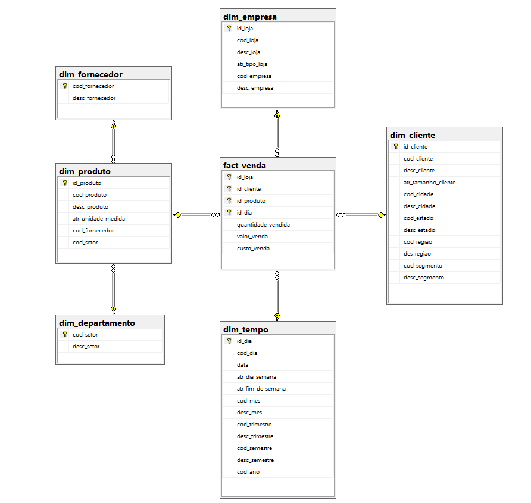
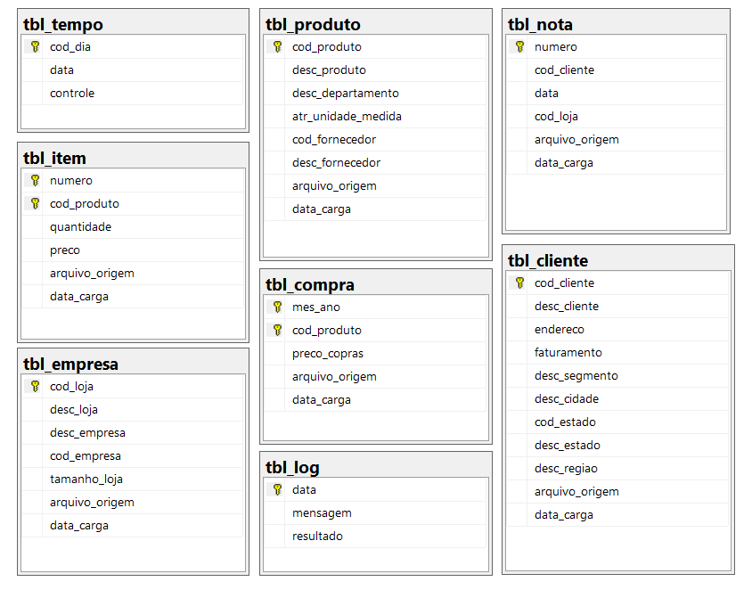
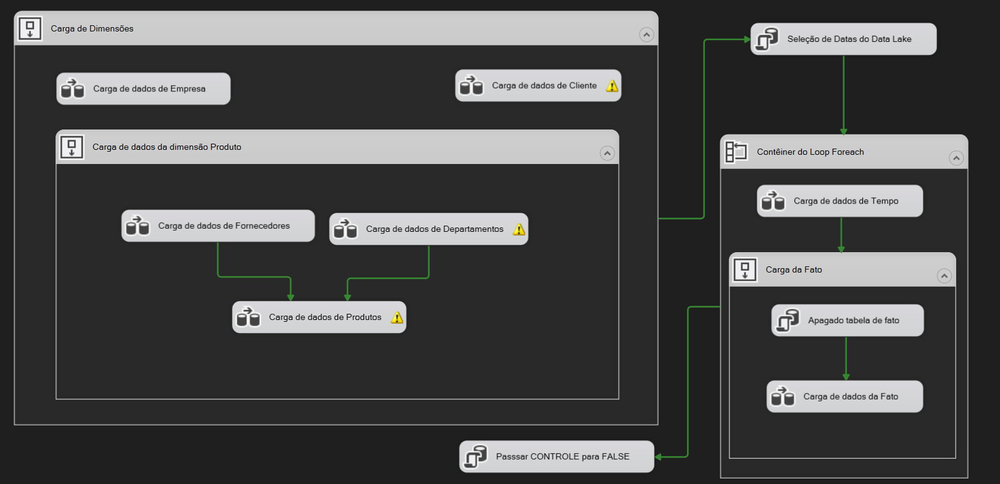

# Dimensões

- **CLIENTE**
    - **Nível Input**
        - Cliente (CNPJ e Nome do Cliente)
    - **Atributos**
        - Tamanho do Cliente
    - **Hierarquias**
        - Geográfica de Cliente
            - Cliente
            - Cidade
            - Estado
            - Região
        - Segmento
            - Cliente
            - Segmento
- **PRODUTO**
    - **Nível Input**
        - Produto (SKU e Nome do Produto)
    - **Atributos**
        - Unidade de Medida
        - **Hierarquias**
            - Fornecedor
                - Produto
                - Fornecedor do Produto
            - Departamento
                - Produto
                - Setor
- **EMPRESA**
    - Nível Input
        - Loja (Identificador e Nome da loja)
    - Atributos
        - Tipo da Loja
    - Hierarquias
        - Loja
        - Empresa (CNPJ e Nome)
- **TICKET**
    - **Nível Input**
        - ID Sequencial (Sequencial do Item)
    - **Hierarquias**
        - Sequencial do Item
        - Número do Ticket
    
- TEMPO
    - **Nível Input**
        - Data (Dia, mês, ano) - AAAAMMDD
    - **Atributos**
        - Dia da Semana
        - Fim de Semana
    - **Hierarquias**
        - Dia
        - Mês
        - Trimestre
        - Semestre
        - Ano

# Indicadores

- Lista de indicadores
    - Inputs
        - Quantidade Vendida
        - Valor da venda
        - Preço Unitário de Compra (Input)
    - Calculados
        - Custo de venda (Preço Unitário de compra (Input) * Valor de venda)
        - Preço unitário de venda (Valor da venda / Quantidade vendida)
        - Preço Unitário de compra (Custo de venda / Quantidade Vendida)
        - Lucro (Valor da venda - Custo da Venda)
        - Rentabilidade ((Lucro / Valor da venda) * 100)

# Matriz Dimensão indicador

|  | CLIENTE | PRODUTO | EMPRESA | TICKET | TEMPO |
| --- | --- | --- | --- | --- | --- |
| Quantidade Vendida | X | X | X | X | X |
| Valor da Venda | X | X | X | X | X |
| Preço Unitário de Venda (Input) | X | X | X | X | X |
| Custo de Venda | X | X | X | X | X |
| Preço Unitário de Venda | X | X | X | X | X |
| Preço unitário de Compra | X | X | X | X | X |
| Lucro | X | X | X | X | X |
| Rentabilidade | X | X | **X** | X | X |

# Criação do Data Warehouse

## Projeto no Power Architect

[DW_ATACADEZ_008.architect~](source/DW_ATACADEZ.architect)

## Script de Criação do Data Warehouse

[Script_DW_AtacaDEZ.sql](source/Script_DW_AtacaDEZ.sql)

## Esquema do Data Warehouse

## Esquema do Data Lake

### Tabelas:

### Script de criação das tabelas

[Script de criação do Data Lake.sql](source/Script_de_criacao_do_Data_Lake.sql)

### Amostra de arquivos enviados pela TI da AtacaDez

[CADASTRO DE CLIENTES.xlsx](source/CADASTRO%20DE%20CLIENTES.xlsx)

[REGIOES DOS ESTADOS.csv](https://prod-files-secure.s3.us-west-2.amazonaws.com/89330e96-0a7d-4165-934e-6209cd391bf1/b3bcd7dd-82c1-4aaa-bd9f-b7a5dcdf25f4/REGIOES_DOS_ESTADOS.csv)

[EMPRESA.CSV](https://prod-files-secure.s3.us-west-2.amazonaws.com/89330e96-0a7d-4165-934e-6209cd391bf1/3be0d544-7425-482d-9890-a80ab4268837/EMPRESA.csv)

[FORNECEDORES.XML](https://prod-files-secure.s3.us-west-2.amazonaws.com/89330e96-0a7d-4165-934e-6209cd391bf1/b1769a84-470e-40b3-874a-099740bd5b8c/FORNECEDORES.xml)

[FORNECEDORES.xsd](https://prod-files-secure.s3.us-west-2.amazonaws.com/89330e96-0a7d-4165-934e-6209cd391bf1/66c36559-70a7-4889-acad-1d4b1d2ebc2f/FORNECEDORES.xsd)

[PRODUTOS.JSON](https://prod-files-secure.s3.us-west-2.amazonaws.com/89330e96-0a7d-4165-934e-6209cd391bf1/3bbd7442-e45e-4019-b215-ec632c363d8e/PRODUTOS.json)

[Compras_202101.csv](https://prod-files-secure.s3.us-west-2.amazonaws.com/89330e96-0a7d-4165-934e-6209cd391bf1/14065312-7cdd-4f69-b913-3b9692964d43/Compras_202101.csv)

[Movimento_Notas_2021_01.csv](https://prod-files-secure.s3.us-west-2.amazonaws.com/89330e96-0a7d-4165-934e-6209cd391bf1/2c21f899-2bf0-432a-86cd-e7e995550ec8/Movimento_Notas_2021_01.csv)

[Movimento_Itens_2021_01.csv](https://prod-files-secure.s3.us-west-2.amazonaws.com/89330e96-0a7d-4165-934e-6209cd391bf1/28a968c8-de6a-4110-9aae-308dcd861134/Movimento_Itens_2021_01.csv)

### Projeto do Visual Studio

[Projeto de criação e carga do Data Lake.zip](https://prod-files-secure.s3.us-west-2.amazonaws.com/89330e96-0a7d-4165-934e-6209cd391bf1/d501e40e-8e36-4f91-98f1-f961a9d7eac7/Projeto_de_criao_e_carga_do_Data_Lake.zip)

## Carga do Data Warehouse

### Projeto do Visual Studio

[Projeto de Criação e Carga do Data Lake e Carga do DW.zip](source/Projeto%20de%20Criação%20e%20carga%20do%20Data%20Lake%20e%20Carga%20do%20DW.zip)
